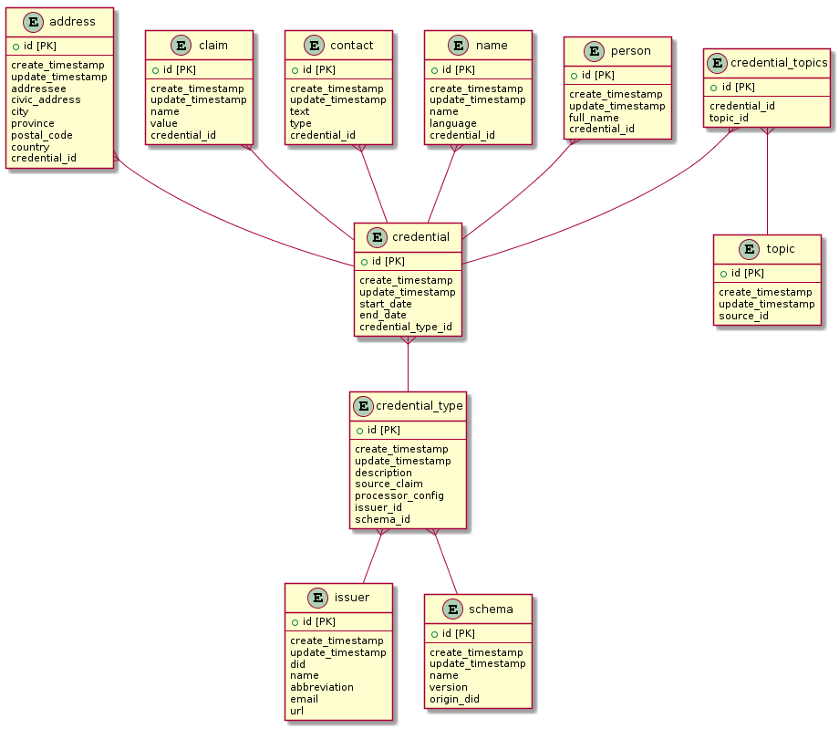

# TOB API V2

## Data Model

The relavant tables in the database related to issuer registration and credential issuance are as follows:



## Populating the Database

The application's database is populated when issuers register themselves and when an issuer issues a claim to TheOrgBook.

The follow tables are populated when an issuer registers itself:

- issuer
- schema
- credential_type

The following tables are populated when a credential is issued:

- subject
- credential
- claim
- address
- contact
- name
- person

Issuers have no control over the creation of `subject`, `credential`, and `claim` records being created. They are created with every credential unconditionally.

`address`, `contact`, `name`, and `person` records are created only if the issuer sends a `mapping` in the issuer registration which we will cover in the next section.

## Issuer Registration

Issuers must register themselves with TheOrgBook before they can begin issuing credentials. The following is an example registration payload:

```json
{
  "issuer": {
    "did": "6qnvgJtqwK44D8LFYnV5Yf", // required
    "name": "BC Corporate Registry", // required
    "abbreviation": "BCReg",
    "email": "bcreg.test.issuer@example.ca",
    "url": "http://localhost:5000"
  },
  "credential_types": [
    {
      "name": "Incorporation", // required
      "schema": "incorporation.bc_registries", // required
      "version": "1.0.31", // required
      "endpoint": "http://localhost:5000/bcreg/incorporation",
      "topic": {
        // Required
        "parent_source_id_claim": "parent_source_id",
        "parent_source_name_claim": "parent_source_name",
        "source_id_claim": "parent_source_id",
        "parent_source_id_claim": "parent_source_id"
      },
      "models": [
        {
          "model": "name", // Required
          "fields": {
            "text": {
              "input": "legal_name",
              "from": "claim"
            },
            "language": {
              "input": "language",
              "from": "claim"
            },
            "end_date": {
              "input": "end_date",
              "from": "claim"
            }
          }
        }
      ]
    },
    {
      "name": "Address",
      "endpoint": "http://localhost:5000/bcreg/dba",
      "schema": "address.bc_registries",
      "version": "1.0.31",
      "topic": {
        // Required
        "parent_source_id_claim": "parent_source_id",
        "parent_source_name_claim": "parent_source_name",
        "source_id_claim": "parent_source_id",
        "parent_source_id_claim": "parent_source_id"
      },
      "cardinality_fields": ["type"],
      "models": [
        {
          "model": "address", // Required
          "fields": {
            "addressee": {
              "input": "addressee",
              "from": "claim"
            },
            "civic_address": {
              "input": "address_line_1",
              "from": "claim"
            },
            "city": {
              "input": "city",
              "from": "claim"
            },
            "province": {
              "input": "province",
              "from": "claim"
            },
            "postal_code": {
              "input": "postal_code",
              "from": "claim"
            },
            "country": {
              "input": "country",
              "from": "claim"
            },
            "type": {
              "input": "type",
              "from": "claim"
            },
            "end_date": {
              "input": "end_date",
              "from": "claim"
            }
          }
        }
      ]
    },
    {
      "name": "Person",
      "endpoint": "http://localhost:5000/bcreg/dba",
      "schema": "person.bc_registries",
      "version": "1.0.31",
      "topic": {
        // Required
        "parent_source_id_claim": "parent_source_id",
        "parent_source_name_claim": "parent_source_name",
        "source_id_claim": "parent_source_id",
        "parent_source_id_claim": "parent_source_id"
      },
      "cardinality_fields": ["contact_type"],
      "models": [
        {
          "model": "person", // Required
          "fields": {
            "full_name": {
              "input": "addressee",
              "from": "claim"
            }
          }
        },
        {
          "model": "contact", // Required
          "fields": {
            "text": {
              "input": "contact",
              "from": "claim"
            },
            "type": {
              "input": "contact_type",
              "from": "claim"
            }
          }
        }
      ]
    }
  ]
}
```

`issuer` provides information about the issuer. If a new registration is sent by the issuer, TheOrgBook will retrieve an existing record by `did` and update the relevant issuer record. At a minimum, the issuer must send `did` and `name`.

`credential_types` specifies the types of credentials that TheOrgBook will process from the issuer. `name`, `schema`, `version`, and `source_claim` are required. `name` is used for display purposes. `schema` and `version` must be valid schema name and version from the Indy ledger. `source_claim` is used to determine which claim in each credential represents a unique subject. In TheOrgBook every credential _must_ be related to a subject (corporation).

`mapping` is optional and allows issuers to populate the following tables:

- address
- contact
- name
- person

These tables are used to power the UI as well as the public API. It is the issuer's responsibility to use this mechanism if it wants its data to be searchable in TheOrgBook.

Take the following `credential_type` for example:

```json
{
  "name": "Incorporation", // required
  "schema": "incorporation.bc_registries", // required
  "version": "1.0.31", // required
  "source_claim": "legal_entity_id", // required
  "endpoint": "http://localhost:5000/bcreg/incorporation",
  "mapping": [
    {
      "model": "name",
      "cardinality_fields": ["type"],
      "fields": {
        "text": {
          "input": "legal_name",
          "from": "claim"
        },
        "type": {
          "input": "dogs",
          "from": "value"
        }
      }
    },
    {
      "model": "address",
      "cardinality_fields": ["type"],
      "fields": {
        "addressee": {
          "input": "addressee",
          "from": "claim",
          "processor": [
            "string_helpers.uppercase",
            "string_helpers.lowercase",
            "example.module.path.function"
          ]
        },
        "civic_address": {
          "input": "address_line_1",
          "from": "claim"
        },
        "city": {
          "input": "city",
          "from": "claim"
        },
        "province": {
          "input": "province",
          "from": "claim"
        },
        "postal_code": {
          "input": "postal_code",
          "from": "claim"
        },
        "country": {
          "input": "country",
          "from": "claim"
        },
        "type": {
          "input": "operating",
          "from": "value"
        },
        "end_date": {
          "input": "2018-06-06",
          "from": "value"
        }
      }
    }
  ]
}
```

Each `mapping` requires a `model` key. This key is used to identify the model it wishes to populate from incoming claims. The acceptable values are `address`, `contact`, `name`, and `person`.

The fields key represents the fields on each model that can be populated from claim data. The available fields on each model are as follows:

| _address_     |
| ------------- |
| addressee     |
| civic_address |
| city          |
| province      |
| postal_code   |
| country       |
| type          |
| start_date    |
| end_date      |

| _contact_  |
| ---------- |
| text       |
| type       |
| start_date |
| end_date   |

| _name_     |
| ---------- |
| text       |
| type       |
| language   |
| source_id  |
| is_legal   |
| start_date |
| end_date   |

| _person_   |
| ---------- |
| full_name  |
| type       |
| start_date |
| end_date   |

Each field must have an `input` and a `from`. If `from` is set to 'value', then the value of that field on that model will always be set to the string literal provided in `input`. If `from` is set to 'claim', then it will retrieve the value of the claim on each each incoming credential. `processor` allows you to run the resulting value from either of the two cases through a series of functions. The input of each function is the output of the last. If you need to add new functions to be made available to the processor, you can make a pull request to TheOrgBook. See more information [here](./processor).

`cardinality_fields` is optional and allows the issuer to specify the cardinality of
